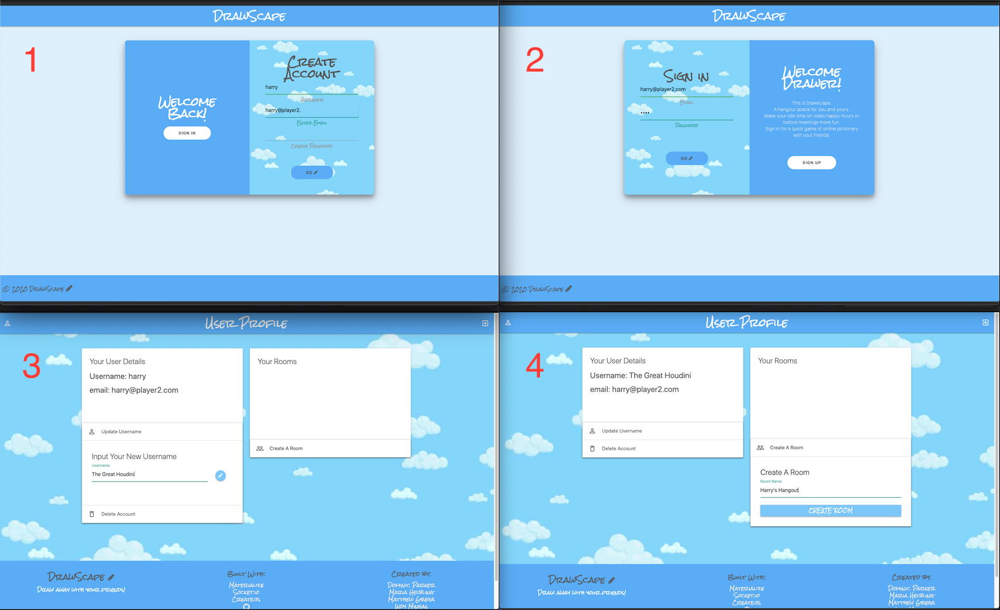
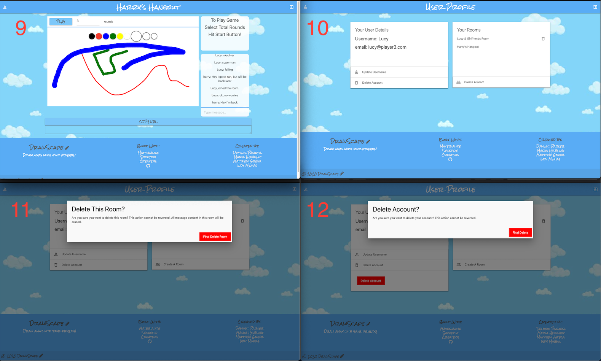

# DrawScape

## An online drawing game that includes chat messaging  

  

## Table of Contents

* [Description](#description)
* [Installation](#installation)
* [Usage](#usage)
* [License](#license)
* [Contributing](#contribution)
* [Tests](#tests)
* [Questions](#questions)

## Description 

Drawscape is an application that allows users to draw online in a fun, game environment. Users can sign up, create chat-drawing rooms, invite their friends, and compete for points by guessing each others' illustrations.  
  
We developed DrawScape because during these times of social distancing, it has never been more important for people to have options for connecting online. Users can play and socialize while using a video messaging application, or they can simply use the real-time chat messaging feature built into DrawScape's room environment. Friends and family can compete to win, or they can relax and play while just hanging out.   
  
DrawScape is a Node JS application. It's server was built using the Node web application framework, Express, and it also utilizes Express-Session and Express-Handlebars. DrawScape's database was built using MySQL, supported by the promise-based Node.js ORM, Sequelize. The front end was built using Express Handlebars and the CSS framework, Materialize. Two of DrawScape's main features are its capacity for online drawing and chat messaging. CreateJS and Socket.io were used to make these possible.      

## Installation

To install this application for development purposes, you will need a MySQL database for data storage. Beyond this, various npm dependencies must be installed. These include: bcrypt, express, express-handlebars, express-session, memorystore, mysql2, sequelize, and socket.io. These are outlined in the package.json file and can be easily installed using Node.js.
For installing dependencies run:
    npm install
For starting the app run:
    npm start

A deployed version of the app cn be [found here](https://drawscape.herokuapp.com).

## Usage 

To use DrawScape, first sign up for an account (1), and log in (2). Upon logging in, you will be redirected to your user profile page. Here you will see your user details, such as your username and the email address you used to create your account. If you would like to update your username, you can do this by clicking on the corresponding button in the left-hand column (3). But first, why not create a drawing room and invite some friends to chat with you? 

    

To do this, click on the 'Create A Room' button in the right-hand column, and type in the name of the room you would like to create (4). After you have done so, you will see this room name appear in the 'Your Rooms' section above. Because you created this room, you are the room's owner. Click on the room name and you will be redirected into it.

Upon entering your created room, you will see a drawing space and colors you can click on to start drawing. But first, invite a friend by clicking on the 'copy url' button below the drawing space. Share this url with the person you would like to invite to your created room. If they have an account they will be redirected to the room. If they don't yet have an account, they will be directed to create one and then will be redirected to your created room. Once in the room, users can chat using the messaging feature in the chat box (6).

To start a game, click the 'play' button in the top left corner of the drawing space. One user will be randomly assigned a word to draw that only they will see (7). The other users can attempt to guess the drawing's associated word by typing guesses into the chat box input. When a user guesses the correct word, they are awarded 30 points, which will show in the scores box (8).

A user may click the profile icon button in the top left corner to return to their profile page. They may also log out by clicking the log out icon button in the top right corner of the page. When users leave the room, their messages will be stored so that they can later return and restart where their conversation ended (9). Rooms where a user is not the owner will also remain in their user profile so that they may easily re-enter the room (10). 

If a user is the owner of a room, they may delete it at any time by clicking on the trashcan icon next to the room name (and confirming), however doing so will delete all message data associated with that room (11). All users may also delete their account at any time by clicking on the 'Delete Account' button (and confirming) (12).  

## License

This application is covered under a [MIT License](https://opensource.org/licenses/MIT).

## Contributing

To contribute to this application, create a pull request. Here are the steps needed for doing that:

* Fork the repo
* Create a feature branch (git checkout -b NAME-HERE)
* Commit your new feature (git commit -m 'Add some feature')
* Push your branch (git push)
* Create a new Pull Request
        
Following a code review, your feature will be merged. 

## Tests

There are no project specific tests provided.

## Questions

Got questions? Feel free to contact the developers.  
Github username:  [MegaGrega](https://github.com/MegaGrega)  
Github username:  [maria-helbling](https://github.com/maria-helbling)  
Github username:  [domjparker](https://github.com/domjparker)    
Github username:  [indyminhas](https://github.com/indyminhas)

---

© 2020, DrawScape. All Rights Reserved.

